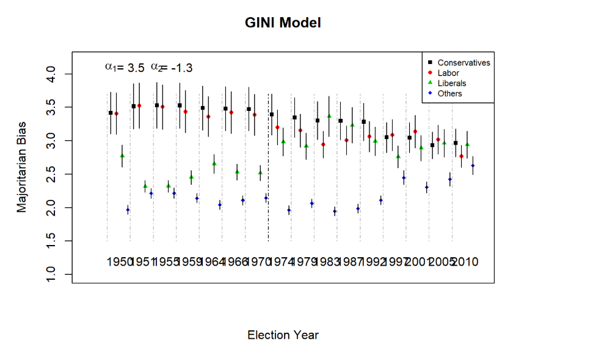
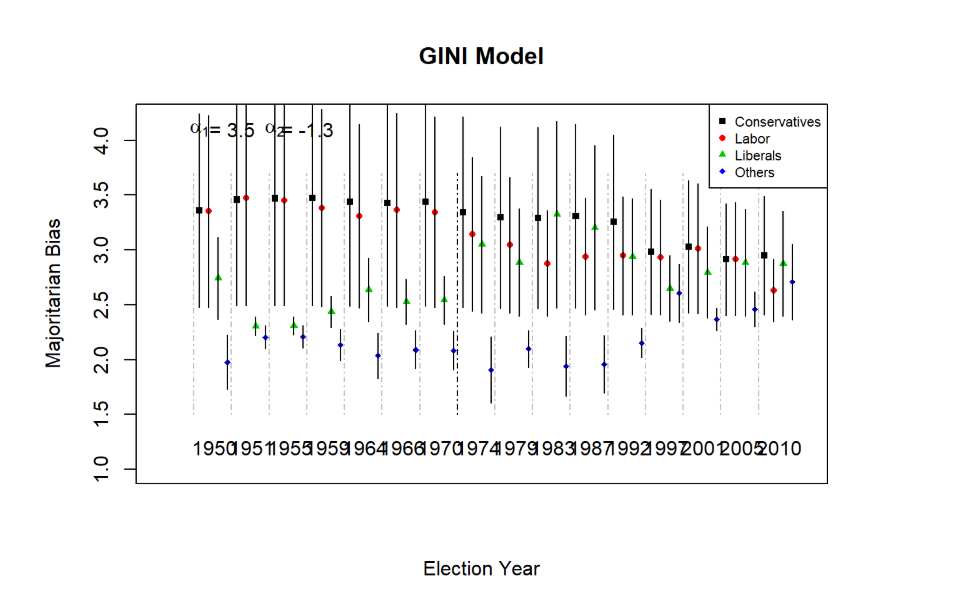

```{r setup, include=FALSE}
knitr::opts_chunk$set(echo = TRUE)
library(foreign)
library(tidyverse)
library(kableExtra)
library(arm)
library(foreign)
library(R2WinBUGS)
library(reldist)
library(MCMCpack)
library(MASS)
library(KernSmooth)

load("UK.mean.sim")
load("UK.rho.sim")
load("UK.1.sim")
load("UK.mean.sim2")
load("UK.0.sim")
load("UK.0bis.sim")


setwd("C:\\Users\\Robert\\Desktop\\Gov_1006\\Replication_1006_2\\Extension")

##
## FUNCTIONS D'HONT
##
## This is the function to allocate the seats.
## 1 or more districts. Data is a vector or matrix of votes (d). 
## A district magnitud (M) or a vector of magnitudes (one for each distrito)
## A threshold percent U or a vector of thresholds (one for each district).
##

dhont <- function(d, M, U)   
{
  ##Verify if there is more than one district
  if (length(d[,1])>=2)   {
    distrito<- length(d[,1])
    v <- vector("list",distrito)
    ##Call the function d'hont2 to allocate seats by district
    for(t in 1:distrito)      {
      v[[t]]<-dhont2(d=d[t,],M=M[t],U=U[t],distrito =1)
    }
    w<- v[[1]]
    for(n in 2:distrito){w<- rbind(w,v[[n]])} 
  }
  else {
    w<-dhont2(d=d,M=M,U=U,distrito=1)
  }
  ##attach names
  rownames(w)<- c(1:distrito)
  w
}          

##
## D'Hont engine
##
dhont2 <- function(d, M, U, distrito){
  N<- length(d)
  s = array(0, dim=c(distrito,N))
  umbral<- sum(d)*U/100
  d[d<=umbral]<-0
  
  ##For magnitudes larger than 1.
  w <- d
  if (M>=2){
    w <- d
    for(i in 2:M) {
      w<- cbind(w,d/i)
    }
  }
  
  ## Retrieve the results
  r1 <- rank(x1 <- 1/w)
  r2 <- matrix(r1,M,N,byrow=TRUE)
  colnames(r2)<-colnames(d)
  r2[r2<=M]<- 1
  r2[r2>=M+1]<- 0
  
  ##attach party names
  colnames(s)<- colnames(d)
  rownames(s)<- "bancas"
  for(i in 1: length(d)){ s[i]<- sum(r2[,i])}
  s
}


##
##
##  Seats and Votes (Shell for Bugs).
##
##

seats.bugs <- function(votes=votes, seats=seats, gini=gini, n.burnin=5000,n.iter=8000, debug=T,model=1, DIC=T)
{
  library(arm)
  
  K <- length(seats[1,])
  N <- length(seats[,1])
  sumS<-rowSums(seats)
  
  if(model==0){
    data.data = list(N=N, K=K, S=seats, V=votes, gini=gini)
    data.inits = function() { list( delta=rnorm(2,0,1) )}
    data.parameters = c("rho", "delta", "p")
    modeltype="mlogit0_mod.txt"
  }
  
  if(model==0.1){  #constant model
    data.data = list(N=N, K=K, S=seats, sumS=sumS)
    data.inits = function() { list( rho=rnorm(1,0,1) )}
    data.parameters = c("rho", "p")
    modeltype="mlogit_baseline_mod.txt"
  }
  
  if(model==0.2){  #mean model
    data.data = list(N=N, K=K, S=seats, sumS=sumS)
    data.inits = function() { list( rho=c(NA,rnorm(K-1,0,1)) )}
    data.parameters = c("rho", "p")
    modeltype="mlogit_mean_mod.txt"
  }
  
  if(model==0.3){  #rho model
    data.data = list(N=N, K=K, S=seats, V=votes,sumS=sumS)
    data.inits = function() { list(rho=rnorm(1,0,1) )}
    data.parameters = c("rho", "p")
    modeltype="mlogit_rho_mod.txt"
  }
  
  if(model==1){
    data.data = list(N=N,K=K, S=seats, V=votes, gini=gini)
    data.inits = function() { list( delta=rnorm(2,0,1) )}
    data.parameters = c("rho", "delta", "p")
    modeltype="mlogit1_mod.txt"
  }
  
  wide.sim = bugs(data.data, data.inits, data.parameters, model.file=modeltype, n.chains=4, n.thin=1, n.burnin=n.burnin,n.iter=n.iter, debug=TRUE, bugs.directory="C:\\Users\\Robert\\Downloads\\winbugs143_unrestricted\\winbugs14_full_patched\\WinBUGS14", DIC=TRUE, working.directory = getwd())
  plot(wide.sim)
  wide.sim
}
```

# Abstract

Calvo and Rodden (2016), based on unfinished research about the spatial organization of elections^[Gudgin and Taylor, 1979], developed a model that established a relationship between a party's territorial distribution and the number of seats that party would win in a first-past-the-post election, based on data from the alst 60 years of UK elections. Their model demonstrates that majoritarian biases increase as the number of parties contesting an election goes up, that small parties are hurt when their vote is dispersed, and that large parties are hurt when their vote is concentrated. I was able to succesfully replicate all aspects of their paper, including analysis outside of R using WinBugs. I extended this project by altering the dataset they used to build the model by removing districts where parties didn't field candidates. I found that that doing this decreased the majoritarian bias of the large Labour and Conservative parties and increased the majoritatian bias of small parties. This provides evidence that the presence of both Labour and Conservative allows fringe parties to be more successful, and that large parties not fielding candidates actually increases the majoritarian bias of their opponents.^[All analysis for this paper is available [here.](https://github.com/rmckenzie11/Replication_1006)]

# Introduction

Calvo and Rodden Abstract: The model Calvo and Rodden built analytically derives the linkage between a party’s territorial distribution of support and the features of its vote-seat curve. They used Monte Carlo methods in a program called WinBUGS to build their model. They found that majoritarian biases increase with the number of parties, and that majoritarian systems harm small parties when their vote is more dispersed than average, and large parties when their vote is more concentrated than average. They then show a practical application of the model with an analysis of elections in the UK, focusing on how UK parties electoral fortunes changed along with their territorial distribution. Because the model is mathematically, not empirically, derived, it is widely applicable to a variety of electoral systems around the world.

Replication of this paper was not easy. Calvo and Rodden built their model outside of R, which meant I had to understand and recreate a complex model in a whole new language. I had thought about replicating their model using rstanarm, but BUGS uses a type of sampling (Gibbs Sampling) that I was unable to recreate in R. As well, the Markov Monte Carlo simulation was much faster in WinBUGS. 

I've extended this paper by removing some of the data and seeing how the model's analysis of UK elections changes. There are some seats in the UK where one of the major parties didn't field a candidate. By removing that data and rerunning the model, we can see how the major parties choosing not to contest a district would influence election results. 


# Extension

This is a replication of the output of the model Calvo and Rodden built, using all their data.


This is the model output with data filtered to only include contests where a district was contested by the 3 major UK parties. As we can see, our error bars are much larger, since substantial amounts of data have been removed, but our point estimates have shifted. 



This updated analysis still shows many of the trends Calvo and Rodden identified, backing up their original conclusions. However, we can see that when all districts are contested, the majoritarian bias that favors large parties is substantially reduced, and small parties achieve more success. A likely explanation for this is that uncontested elections receive substantially more 3rd party votes, even though the eventual winner is almost always the one major party that does field a candidate. Since the small parties receieve more votes but no more victories, the bias against them is larger in uncontested elections. 


# Literature Review

In the 1970s, quantitative social science was still in its infancy. Some of the earliest innovators were Graham Gudgin and Peter Taylor, who focused their attention on how votes translated into seats. Earlier work by Kendall and Stuart (1950) had identified a "law of cubic proportions", which modeled the relationship between votes and seats:
$$\frac{S_1}{S_2} = (\frac{V_1}{V_2})^3$$, where $S_1/S_2$ is the # of seats won by party 1 divided by the # of seats won by party 2, and $V_1/V_2$ is the # of votes won by party 1 divided by the # of votes won by party 2. While the "cubic law" was rapidly accepted by political scientists, a series of election results and further papers began to chip away at the theory. Gudgin and Taylor built a new model to determine the linkage between votes and seats using the combination of two maps: the spatial distribution of support across a country and electoral districts. Their theoretical model relied on a host of assumptions, but was successful in determining which components of geographic distribution had the most impact on election outcomes. Calvo and Rodden have extended and rebuilt Gudgin and Taylor's model using modern techniques to eleminate some of these assumptions and make results more applicable.

# Appendix 

I have replicated the most important results from the paper below. I was able to successfully replicate almost every figure and table Calvo and Rodden did. I did not replicate Figure 6, which was a geographic map probably made using leaflet, as that would've taken a great deal of time and is tangential to the papers main results. My figures aren't as neat and clear as the ones in the actual paper, but the results are the same. 

This paper, despite being in political science, is actually mostly about math. I had two approaches when considering how I wanted to extend the paper: do more math or evaluate Calvo and Rodden’s model on more data outside the UK. I propose doing the second, with the goal of evaluating whether their theoretical model’s predictions align with data from many different countries, or if it was just lucky that the UK happened to have similar results to the theoretical results. I will need to obtain and clean electoral data from some multi-party first-by-the-post country, and then rework the WinBugs model around that data. Ideally, the model will discern majoritarian bias in whatever country I choose easily. I think interesting possible candidates include India, Canada, or South Africa, but I will need to do more research to figure out exactly which country will be the best data source. This doesn’t advance knowledge in quite the way King means in Publication, Publication, but I think that validating a model on more data is still a worthy addition to the paper, because it tells us more about how the model works and how much we can trust its conclusions. I know this is far fewer words than expected, but my proposed extension is simple enough to describe. 

```{r, fig.cap = "Data and Graph from Harvard Dataverse edition of The Achilles Heel of Plurality Systems: Geography and Representation in Multiparty Democracies^[Calvo and Rodden, 2014]", echo = F}
data <- read.dta("Uk_postwar_with three parties.dta") %>%
  filter(gvotesc != 0,
         gvotesl != 0)
data2 <- read.dta("party aggregates_wide.dta")
dataElec <- split(data, data$year, drop = FALSE)

my.reps=16
my.gini = array(0, dim=c(my.reps,4))
my.sd = array(0, dim=c(my.reps,4))
my.mean = array(0, dim=c(my.reps,4))
my.median = array(0, dim=c(my.reps,4))
my.votes = array(0, dim=c(my.reps,4))
my.pvotes = array(0, dim=c(my.reps,4))
my.seats = array(0, dim=c(my.reps,4))
theo.cor = array(0, dim=c(my.reps,4,4))
my.cor = array(0, dim=c(my.reps,4,4))
CV = array(0, dim=c(my.reps,4,4))

for(i in 1:my.reps){
  party3<- dataElec[[i]]$votesl/dataElec[[i]]$total
  party2<- dataElec[[i]]$votess/dataElec[[i]]$total
  party1<- dataElec[[i]]$votesc/dataElec[[i]]$total
  party4<- dataElec[[i]]$newothers/dataElec[[i]]$total
  
  V<-as.matrix(cbind(party1,party2,party3,party4))
  S<-dhont(d=V,M=rep(1,length(party3)),U=1)
  pV<- V/rowSums(V) # percent vote by party and district
  my.mean[i,]<-apply(pV, 2, mean)
  my.median[i,]<-apply(pV, 2, median)
  my.sd[i,]<- apply(pV, 2, sd)
  CV<-my.sd/my.mean
  my.votes[i,]<-colSums(V) # sum of votes all districts
  my.pvotes[i,]<-my.votes[i,]/sum(my.votes[i,]) # percent vote by party and election
  
  my.seats[i,]<-colSums(S) 
  my.gini[i,]<- c(gini(party1),gini(party2),gini(party3),gini(party4))
  
} 

plot(my.gini,CV, ylab="Empirical Coefficient of Variation", xlab="GINI")
```

```{r, echo = F}

##
## Lorenz Curve Liberals
##

sparty1 <- sort(dataElec[[1]]$votesl/dataElec[[1]]$total)
sparty2 <- sort(dataElec[[16]]$votesl/dataElec[[16]]$total)
xout <- (0:1000)/1000
alpha1 <- seq(along=sparty1)/length(sparty1)
galpha1 <- cumsum(sparty1)/sum(sparty1)
fn1 <- approx(x=alpha1,y=galpha1,xout=xout)
plot(x = alpha1, y = galpha1, type = "l", xlim=c(0,1.0), xlab = "proportion of population", ylab = "proportion of party vote", ylim=c(0,1.0))

alpha2 <- seq(along=sparty2)/length(sparty2)
galpha2 <- cumsum(sparty2)/sum(sparty2)
fn1 <- approx(x=alpha2,y=galpha2,xout=xout)
lines(x = alpha2, y = galpha2, lty = 2)
abline(0,1, lty=3)
legend(x=c(0,0),y=c(1.03,1.03),cex=0.8, bty="n", legend=c("Liberals, 1950: GINI 0.45","Liberals, 2010: 0.25", "Perfectly Dispersed"), lty=c(1,2,3), col=c(1,1,2))
arrows(.44, .15, .4, .22, col= 4,cex=.5,length=.1)

##
## Lorenz Curve Conservatives
##

sparty1 <- sort(dataElec[[1]]$votesc/dataElec[[1]]$total)
sparty2 <- sort(dataElec[[16]]$votesc/dataElec[[16]]$total)
xout <- (0:1000)/1000
alpha1 <- seq(along=sparty1)/length(sparty1)
galpha1 <- cumsum(sparty1)/sum(sparty1)
fn1 <- approx(x=alpha1,y=galpha1,xout=xout)
plot(x = alpha1, y = galpha1, type = "l", xlim=c(0,1.0), xlab = "proportion of population", ylab = "proportion of party vote", ylim=c(0,1.0))

alpha2 <- seq(along=sparty2)/length(sparty2)
galpha2 <- cumsum(sparty2)/sum(sparty2)
fn1 <- approx(x=alpha2,y=galpha2,xout=xout)
lines(x = alpha2, y = galpha2, lty = 2)
abline(0,1, lty=3)
legend(x=c(0,0),y=c(1.03,1.03),cex=0.8, bty="n", legend=c("Conservatives, 1950: GINI 0.16","Conservatives, 2010: GINI 0.23", "Perfectly Dispersed"), lty=c(1,2,3), col=c(1,1,2))
arrows(.4, .28, .42, .25, col= 4,cex=.5,length=.1)

##
## Lorenz Curve Socialists
##

sparty1 <- sort(dataElec[[1]]$votess/dataElec[[1]]$total)
sparty2 <- sort(dataElec[[16]]$votess/dataElec[[16]]$total)
xout <- (0:1000)/1000
alpha1 <- seq(along=sparty1)/length(sparty1)
galpha1 <- cumsum(sparty1)/sum(sparty1)
fn1 <- approx(x=alpha1,y=galpha1,xout=xout)
plot(x = alpha1, y = galpha1, type = "l", xlim=c(0,1.0), xlab = "proportion of population", ylab = "proportion of party vote", ylim=c(0,1.0))

alpha2 <- seq(along=sparty2)/length(sparty2)
galpha2 <- cumsum(sparty2)/sum(sparty2)
fn1 <- approx(x=alpha2,y=galpha2,xout=xout)
lines(x = alpha2, y = galpha2, lty = 2)
abline(0,1, lty=3, col=2)
legend(x=c(0,0),y=c(1.03,1.03),cex=0.8, bty="n", legend=c("Labor, 1950: GINI 0.18","Labor, 2010: 0.30", "Perfectly Dispersed"), lty=c(1,2,3), col=c(1,1,2))
arrows(.4, .28, .44, .22, col= 4,cex=.5,length=.1)

##
## Lorenz Curve All
##

sparty1<-sort(rbind(dataElec[[1]]$votesc/dataElec[[1]]$total, dataElec[[1]]$votess/dataElec[[1]]$total, dataElec[[1]]$votesl/dataElec[[1]]$total))
sparty2<-sort(rbind(dataElec[[16]]$votesc/dataElec[[16]]$total, dataElec[[16]]$votess/dataElec[[16]]$total, dataElec[[16]]$votesl/dataElec[[16]]$total))
xout <- (0:1000)/1000
alpha1 <- seq(along=sparty1)/length(sparty1)
galpha1 <- cumsum(sparty1)/sum(sparty1)
fn1 <- approx(x=alpha1,y=galpha1,xout=xout)
plot(x = alpha1, y = galpha1, type = "l", xlim=c(0,1.0), xlab = "proportion of population", ylab = "proportion of party vote", ylim=c(0,1.0))

alpha2 <- seq(along=sparty2)/length(sparty2)
galpha2 <- cumsum(sparty2)/sum(sparty2)
fn1 <- approx(x=alpha2,y=galpha2,xout=xout)
lines(x = alpha2, y = galpha2, lty = 2)
abline(0,1, lty=3, col=2)
legend(x=c(0,0),y=c(1.03,1.03),cex=0.8, bty="n", legend=c("All Parties, 1950","All Parties, 2010", "Perfectly Dispersed"), lty=c(1,2,3), col=c(1,1,2))


#####################################
##
## Winbugs models
##
#####################################
```

```{r, echo = F}
my.rho<- UK.0.sim$mean$rho
my.sd.rho<- UK.0.sim$sd$rho
my.rho.t<- exp(sqrt((1-my.mean)/my.mean))

##
## FIGURE 5
##

plot(1:16, my.rho[,1], ylim=c(1,4.2), xlim=c(0,17), pch=15, cex=.7, xlab="Election Year", ylab="Majoritarian Bias",  xaxt='n', main="GINI Model")
for(i in 1:16){
  segments(i,my.rho[i,1]+1.96*my.sd.rho[i,1],i,my.rho[i,1]-1.96*my.sd.rho[i,1])
  segments(i-.15,1.5,i-.15,3.7, lty=4, col="grey")
  text(i+.4,1.2, data2[i,1])
}
points((1:16)+.25,my.rho[,2], pch=16, col=2, cex=.7)
for(i in 1:16){
  segments(i+.25,my.rho[i,2]+1.96*my.sd.rho[i,2],i+.25,my.rho[i,2]-1.96*my.sd.rho[i,2])
}
points((1:16)+.5,my.rho[,3], pch=17, col=3, cex=.7)
for(i in 1:16){
  segments(i+.5,my.rho[i,3]+1.96*my.sd.rho[i,3],i+.5,my.rho[i,3]-1.96*my.sd.rho[i,3])
}
points((1:16)+.75,my.rho[,4], pch=18, col=4, cex=.7)
for(i in 1:16){
  segments(i+.75,my.rho[i,4]+1.96*my.sd.rho[i,4],i+.75,my.rho[i,4]-1.96*my.sd.rho[i,4])
}
legend("topright",col=c(1:4),legend=c("Conservatives","Labor","Liberals","Others"),pch =c(15:18), cex=.7)
segments(8-.15,1.5,8-.15,3.7, lty=4, col="black")
#text(1.2, 3.2, expression(paste(delta," = "," 0.81 ",sep=""), cex = 1))
text(1, 4.1, expression(alpha[1]), cex = 1)
text(1.8, 4.1, " = 3.5", cex = 1)
text(3, 4.1, expression(alpha[2]), cex = 1)
text(3.8, 4.1, " = -1.3", cex = 1)

##
## GINI RESULTS USING WINBUGS
##


mssMean <- sum((UK.mean.sim$median$p-my.seats/rowSums(my.seats))^2)
mssRho <- sum((UK.rho.sim$median$p-my.seats/rowSums(my.seats))^2)
mss0 <- sum((UK.0.sim$median$p-my.seats/rowSums(my.seats))^2)
mss0bis <- sum((UK.0bis.sim$median$p-my.seats/rowSums(my.seats))^2)
mss1 <- sum((UK.1.sim$median$p-my.seats/rowSums(my.seats))^2)

devianceMean <- quantile(UK.mean.sim2$sims.matrix[,length(UK.mean.sim2$sims.matrix[1,])], prob=c(.2,.5,.8))
devianceRho <- quantile(UK.rho.sim$sims.matrix[,length(UK.rho.sim$sims.matrix[1,])], prob=c(.2,.5,.8))
deviance0 <- quantile(UK.0.sim$sims.matrix[,length(UK.0.sim$sims.matrix[1,])], prob=c(.2,.5,.8))
deviance0bis <- quantile(UK.0bis.sim$sims.matrix[,length(UK.0bis.sim$sims.matrix[1,])], prob=c(.2,.5,.8))
deviance1 <- quantile(UK.1.sim$sims.matrix[,length(UK.1.sim$sims.matrix[1,])], prob=c(.2,.5,.8))

delta1 <- quantile(UK.0.sim$sims.matrix[,65], prob=c(.2,.5,.8))
delta2 <- quantile(UK.0.sim$sims.matrix[,66], prob=c(.2,.5,.8))

op<-par(mfrow = c(1, 2),ann=TRUE)
plot(my.seats/rowSums(my.seats)~UK.rho.sim$median$p, ylab="Observed Seat Shares", xlab="Predicted Seat Shares (Fixed Rho Model)")
abline(lm(c(my.seats/rowSums(my.seats))~c(UK.rho.sim$median$p)), col=2, lty=2)
text(.1, .5, paste("DIC ",devianceRho[2], sep=""))
plot(my.seats/rowSums(my.seats)~UK.0.sim$median$p, ylab="Observed Seat Shares", xlab="Predicted Seat Shares (Full Model)")
abline(lm(c(my.seats/rowSums(my.seats))~c(UK.0.sim$median$p)), col=2, lty=2)
text(.1, .5, paste("DIC ",deviance0[2], sep=""))
par(op)

op<-par(mfrow = c(2, 2),ann=TRUE)
plot(my.seats/rowSums(my.seats)~UK.rho.sim$mean$p)
abline(lm(c(my.seats/rowSums(my.seats))~c(UK.rho.sim$mean$p)), col=2, lty=2)
plot(my.seats/rowSums(my.seats)~UK.0.sim$mean$p)
abline(lm(c(my.seats/rowSums(my.seats))~c(UK.0.sim$mean$p)), col=2, lty=2)
plot(my.seats/rowSums(my.seats)~UK.mean.sim2$mean$p)
abline(lm(c(my.seats/rowSums(my.seats))~c(UK.mean.sim2$mean$p)), col=2, lty=2)
par(op)
```


```{r, echo = F}
#######
##
## FIGURE 7
##
#######

seat.hat.rm<- exp(rowMeans(UK.0.sim$median$rho)*log(my.pvotes))/rowSums(exp(rowMeans(UK.0.sim$median$rho)*log(my.pvotes)))
seat.hat<- exp(UK.0.sim$median$rho*log(my.pvotes))/rowSums(exp(UK.0.sim$median$rho*log(my.pvotes)))

#win.metafile(filename = "Actual vs observed rho.wmf", width = 10, height = 10, pointsize = 12, restoreConsole = TRUE)
plot(round(seat.hat.rm[,1],3)*100,round(seat.hat[,1],3)*100, pch=16, xlim=c(0,72), ylim=c(0,72), xlab="Expected Seats (Fixed Rho)", ylab="Expected Seats(Actual Rho)", cex=1)
points(round(seat.hat.rm[,2],3)*100,round(seat.hat[,2],3)*100, pch=17,col=2, cex=1)
points(round(seat.hat.rm[,3],3)*100,round(seat.hat[,3],3)*100, pch=18,col=4, cex=1)
legend("topleft",col=c(1,2,4),legend=c("Conservatives","Labor", "Liberals"),pch =c(16,17,18), cex=1)
abline(0,1)
#dev.off()
```


## References ##

---
nocite: '@*'
...