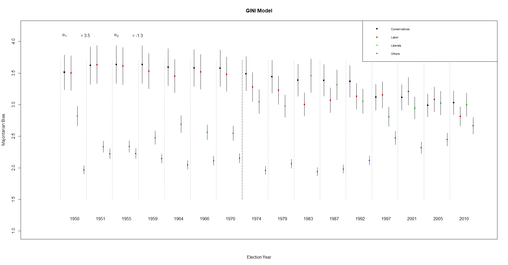
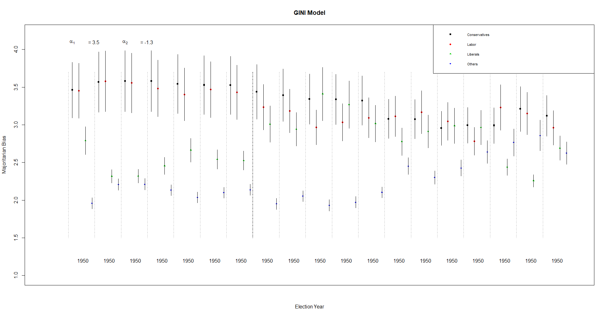
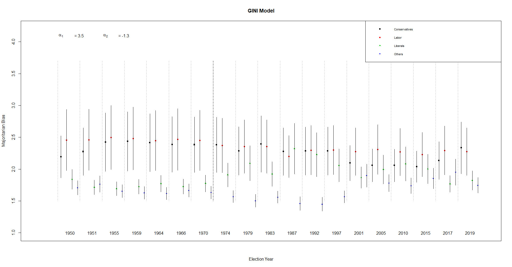

```{r setup, include=FALSE}
knitr::opts_chunk$set(echo = TRUE)
```


# Abstract

  Calvo and Rodden (2016) attempt to address the puzzle of multi-party competition in democracies by building an analytical model of the relationship between a party's territorial distribution of support and its vote-seat curve, and then use their model to analyze election results in the UK from 1950-2010. Their model shows an increase in majoritarian biases as the number of parties contesting an election goes up, that small parties are hurt when their vote is dispersed, and that large parties are hurt when their vote is concentrated. I was able to successfully replicate all aspects of their paper, including analysis outside of R using WinBugs. The last few years have been tumultuous in British politics, so I tested Calvo and Rodden's model on updated UK election data, in particular looking at how their model deals with the majoritarian bias of regionalist parties that only contest certain seats (the Scottish National Party and Plaid Cymru). I found that replacing the Liberals in the 2015, 2017, and 2019 elections in their model with the SNP and PC results in model output that is at odds with the logical underpinnings of the model, but that looking at just Scotland and Wales during that period leads to model output that aligns with true results ^[All analysis for this paper is available [here.](https://github.com/rmckenzie11/Replication_1006)]

# Intro
  Calvo and Rodden are concerned that the consensus on majoritarian democracies dismisses the impact of small parties.  Working from an outline of the rules governing the relationship between geographic distribution of support and legislative representation, first established by Gudgin and Taylor (1979), Calvo and Rodden empirically model the vote-seat curve of a party as a function of their geographic support. Their model sheds light on how dispersion and concentration effects election outcomes, often very unfairly.  

  I replicated Calvo and Rodden’s paper using code and data provided on the Harvard Dataverse. Code was cleaned and organized in R, and data was then piped into WinBUGS, where the model was built. The replicated code provided was a tremendous help, and the only issues I encountered were incorporating WinBUGS into my workspace. Due to lack of processing power, I did simplify the number of iterations per Markov chain.  

  One of the great advantages of Calvo and Rodden’s model is that it is purely empirical and can be applied to many different elections. This will be further discussed in the literature review, but since 2015, the model has been used to analyze elections in Switzerland, Massachusetts, Kenya, China, the UK, and Mexico. I was curious to see how their model would deal with regionalist parties like the Scottish National Party and Plaid Cymru. These parties don’t contest most seats in an election, but their extremely concentrated support means they win far more seats than their proportion of votes.  

  I updated the original UK election dataset to include results from the 2015, 2017, and 2019 general elections. In those elections, the SNP and PC substantially outperform the Liberal party, so I grouped the Liberals in with minor parties and measured the majoritarian bias of the regionalist parties separate from other parties. This led to model output that is strikingly different from the actual election results. The SNP and PC have a very small majoritarian bias, and the bias of the “other” parties skyrockets. Since a main conclusion of Calvo and Rodden’s model is that being concentrated helps small parties, this result is very surprising.
I then filtered the dataset to just look at seats contested in Wales and Scotland. Using this dataset, the model output was much more in with what we would expect from parties with highly concentrated support. Before the first resurgence of the SNP in the 1970s, they were hurt by their dispersion across Scotland, and after their second great resurgence in the 2015 election, when they became a major party in the region, this dispersion helped them substantially. The Liberals (grouped in with others) are hurt as they are throughout the country by the dispersion of their support, and the Conservative party has benefited from their concentration of votes in non-SNP regions, whereas the Labour party, which used to dominate Scottish politics, has been largely replaced by the SNP and is hurt by its broad but limited appeal to Scottish and Welsh voters. 

# Literature Review

  From the earliest days of quantitative social science, political scientists have attempted to model the relationship between votes and seats. Among the first were Kendall and Stuart (1950), who derived the "law of cubic proportions":
$$\frac{S_1}{S_2} = (\frac{V_1}{V_2})^3$$, where $S_1/S_2$ is the # of seats won by party 1 divided by the # of seats won by party 2, and $V_1/V_2$ is the # of votes won by party 1 divided by the # of votes won by party 2. While the cubic law has now been largely dismissed as too simple, it provided inspiration for academics like Gudgin and Taylor (1979), who first started to explore the impact of geography on elections. They identified some principles that would affect the vote-seat curve using the combination of two maps: the spatial distribution of support across a country and electoral districts.  

  A lot of earlier work on the impact of geography focuses on gerrymandering, including King and Browning (1987) who built a statistical method to analyze bias in redistricting, and Johnston (2002), who tried to determine how much gerrymandered redistricting would influence election outcomes. In 2010, Borisyuk et al. make the case that geography is the most important source of bias in elections. However, a major assumption underpinning this research was that votes change uniformly across districts. Calvo and Rodden find this assumption highly unrealistic, so they attempt to model the specific impact of geographic support on majoritarian bias, accounting for changes at the district level rather than at a country-wide level. This approach was pioneered by Calvo (2009) and Linzer (2012), but the important difference in this work is that the model accounts for changes in geographic support over time.  
  
  Recently, this model has been primarily used to demonstrate unfairness and bias in political systems. Sng, Chia, and Feng (2018) find that political divides within Chinese provinces that were strategically important when boundaries were drawn in the 13th century don’t mirror divides in the country at large. This is an application of gerrymandering for national security, where heterogenous populations are divided so that no minority group can concentrate support and take control. 
McGhee (2017) expands on work like King and Browning (1987) using this new model, presenting new ways to identify bias in redistricting. Menendez and Becher (2019) use the model to directly compare outcomes between a majoritarian system and a proportional system and conclude that while proportional systems might be better at representing popular preferences, the quality of politicians in proportional systems is often worse.  

  A substantial inspiration for my own replication comes from Thrasher, Borisyuk, Rallings, Johnston, and Pattie (2015), a group of heavy hitters in UK political science. They wrote a post-mortem of the 2015 election, where the SNP made tremendous gains and Labour suffered. They conclude that historically, Labour had benefited and the Conservatives had been hurt by their geographic distributions, a result backed up by Calvo and Rodden’s model, but that this changed in 2015. However, they acknowledge that features of the election complicate analysis, specifically the rise of the UK Independence Party, an issue-driven party that saw very dispersed but extensive support yet completely failed in turning those votes into seats. They conclude that determining bias in elections using Calvo and Rodden’s model where new parties are emerging and old parties are faltering requires additional guidance. 

# Replication

I was able to succesfully replicate the important results from the paper. A few of the figures use data from outside sources, which I did not attempt to replicate. 

# Extension

Below, I have analysis on the three datasets:








